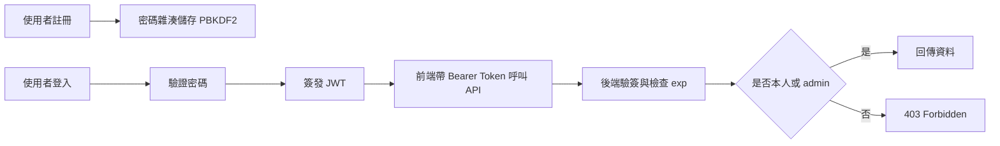
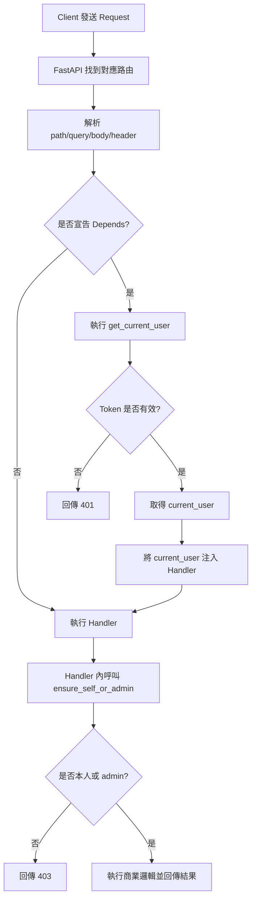

<!-- _class: lead -->

# JWT 教學範例修改總覽

> 課程: 後端 API 安全實作
> 
> 主題: JWT 登入、驗證與功能權限控管
> 
> 專案: MyChatbackend

## 解釋內容
- 目標: 將原本「明碼密碼 + 無驗證」升級為「JWT 登入 + Bearer 驗證 + 功能權限控管」
- 範圍: 註冊、登入、使用者資料、好友、聊天室、訊息 API

## 流程


## 公式說明
- 權限判斷函式:
  $$
  allow = (uid_{token} = uid_{path}) \lor (role = admin)
  $$

---

# 修改內容地圖

## 解釋內容
- 本次修改可分為 5 層: 密碼安全、Token 簽發、Token 驗證、路由保護、角色授權
- 設計重點是「最小侵入」，盡量保留既有 API 路徑

## 流程
1. register: 密碼先雜湊再寫入資料庫
2. login: 驗證密碼後簽發 JWT
3. protected route: 解析 Bearer Token 取得 current_user
4. authorize: 驗證 self-or-admin

## 公式說明
- 系統風險可簡化為:
  $$
  Risk = P(token\_leak) \times Impact
  $$
- 透過短效 token 可降低長期風險暴露

---

# 密碼儲存改造: PBKDF2

## 解釋內容
- 註冊時不再儲存明碼，改為 `pbkdf2_sha256$iterations$salt$hash`
- 登入驗證採用同一演算法重算並比對
- 舊資料若是明碼，登入成功後自動升級為雜湊

## 流程
1. 生成隨機 salt
2. 使用 PBKDF2-HMAC-SHA256 計算 hash
3. 儲存演算法、回合數、salt、hash
4. 登入時重新計算並 compare_digest

## 公式說明
- 密碼衍生:
  $$
  DK = PBKDF2(HMAC\text{-}SHA256,\ password,\ salt,\ iterations)
  $$

---

# JWT 簽發設計

## 解釋內容
- 登入成功後回傳 access_token
- payload 包含 `sub`, `username`, `role`, `iat`, `exp`
- 以 HS256 進行簽章，確保內容不可竄改

## 流程
1. 建立 header 與 payload
2. Base64URL 編碼
3. 以 `JWT_SECRET` 做 HMAC-SHA256 簽章
4. 組成 `header.payload.signature`

## 公式說明
- JWT 組成:
  $$
  JWT = b64url(header) . b64url(payload) . b64url(signature)
  $$
- 簽章:
  $$
  signature = HMAC_{SHA256}(secret,\ header.payload)
  $$

---

# JWT 驗證機制

## 解釋內容
- 後端從 `Authorization: Bearer <token>` 取得 token
- 驗證內容包含: 格式、演算法、簽章、過期時間
- 驗證失敗回傳 401

## 流程
1. 解析三段 token
2. 驗證 header 的 alg
3. 重新計算 signature 並 compare_digest
4. 檢查 `exp >= now`

## 公式說明
- 時效驗證條件:
  $$
  valid\_time = (exp \ge now)
  $$
- 完整有效條件:
  $$
  valid = valid\_sig \land valid\_time \land valid\_format
  $$

---

# 路由保護: Current User 依賴注入

## 解釋內容
- 新增 `get_current_user` 作為受保護路由的共用依賴
- 在路由簽名加入 dependency，避免每支 API 重複寫驗證
- Token 的 `sub` 對應到使用者 id
- 在 FastAPI 中，`Depends(...)` 代表「這個參數不是直接由使用者傳入，而是先由框架幫你準備好」

## 流程
1. 路由進入前先執行 dependency
2. 解 token 取得 `sub`
3. 查詢使用者是否存在
4. 將 current_user 注入 handler

## 公式說明
- 依賴抽象可表示為:
  $$
  handler(request) = f(request,\ current\_user)
  $$

---

# Depends 是什麼

## 解釋內容
- `Depends` 是 FastAPI 的依賴注入機制，用來宣告「某段共用前置邏輯要先執行」
- 它常用在認證、授權、資料庫連線、共用驗證、租戶資訊載入等情境
- 在這個專案裡，`current_user: dict = Depends(get_current_user)` 的意思是: 先執行 `get_current_user`，再把結果放進 `current_user`

## 流程
1. request 進到某支 API
2. FastAPI 先讀取 route 參數與 dependencies 宣告
3. 執行 `get_current_user`
4. 若成功，將回傳值注入 `current_user` 後再執行 handler

## 公式說明
- 依賴注入可抽象成:
  $$
  current\_user = dependency(request)
  $$
  $$
  response = handler(request,\ current\_user)
  $$

---

# Depends、Helper Function、Decorator 的差別

## 解釋內容
- Helper function: 由你在 handler 裡手動呼叫，例如 `ensure_self_or_admin(...)`
- Dependency: 由 FastAPI 在進入 handler 前自動執行，例如 `Depends(get_current_user)`
- Decorator: 由 Python 在函式外層包裝邏輯，通常用於通用攔截，但在 FastAPI 中要處理參數與文件會比較麻煩

## 流程
1. Helper function 模式: handler 先開始，再手動呼叫共用函式
2. Dependency 模式: 框架先執行共用函式，再進 handler
3. Decorator 模式: Python 先包裝 handler，再由包裝後函式接管流程
4. 對 API 框架而言，dependency 最能與參數驗證和 OpenAPI 整合

## 公式說明
- 三者的控制位置可表示為:
  $$
  Helper = handler + manual\ call
  $$
  $$
  Dependency = framework\ pre\text{-}handler\ injection
  $$
  $$
  Decorator = wrapped(handler)
  $$

---

# 為什麼這支程式比較適合 Depends

## 解釋內容
- 這支程式的登入資訊來自 HTTP Header 內的 Bearer Token，這本來就是 request 前置處理，非常適合交給 dependency
- `get_current_user` 會先驗證 token、找出使用者，再把結果提供給多支 API 重用
- `ensure_self_or_admin` 目前保留成 helper function 也合理，因為它還需要搭配每支路由自己的 `user_id` 參數做授權判斷
- 也就是說，這個專案最自然的分工是: 認證用 dependency，授權用 helper function

## 流程
1. `Depends(get_current_user)` 統一處理登入身分
2. handler 拿到 `current_user`
3. handler 再依照自己的 path 參數執行 `ensure_self_or_admin`
4. 通過後才進入資料查詢或更新

## 公式說明
- 專案中的責任分工可表示為:
  $$
  Access\ Control = Authentication\ by\ Dependency + Authorization\ by\ Helper
  $$

---

# Request 進來後，Dependency 怎麼執行

## 解釋內容
- 這張圖說明 FastAPI 在真正執行 route handler 前，會先處理 `Depends(get_current_user)`
- 如果 dependency 失敗，例如 token 無效，流程會在進入 handler 前就中止並回傳錯誤

## 流程


## 公式說明
- 整體執行順序可整理為:
  $$
  request \rightarrow dependency\ resolution \rightarrow handler \rightarrow authorization \rightarrow response
  $$

---

# 功能權限: Self or Admin

## 解釋內容
- 採最直觀 RBAC 規則: 本人可操作自己的資料，admin 可跨帳號操作
- admin 由環境變數 `ADMIN_USERNAMES` 控制
- 權限不足回傳 403
- 這一層真正執行判斷的核心函式就是 `ensure_self_or_admin(path_user_id, current_user)`

## 流程
1. 從 path 取得 `user_id`
2. 從 token 取得 `current_user.id` 與 `role`
3. 執行 self-or-admin 檢查
4. 通過才進入商業邏輯

## 公式說明
- 授權函式:
  $$
  authorize(u_{path}, u_{token}, role) = (u_{path}=u_{token}) \lor (role=admin)
  $$

---

# 函式解析: ensure_self_or_admin

## 解釋內容
- 這個函式的目的不是「驗證你有沒有登入」，而是「你登入之後，有沒有權限操作這筆資源」
- `path_user_id` 代表 URL 中要操作的使用者，例如 `/users/alice001`
- `current_user` 代表 token 解出來的登入者資訊
- 如果登入者不是本人，而且角色也不是 admin，就立刻丟出 `403 Permission denied`

## 流程
1. 路由先透過 `get_current_user` 取得登入者
2. 將路徑中的 `user_id` 與登入者 `id` 傳入 `ensure_self_or_admin`
3. 函式比對 `current_user["id"] != path_user_id`
4. 若同時 `current_user["role"] != "admin"`，則拒絕請求

## 公式說明
- 程式中的 if 條件可翻成布林邏輯:
  $$
  deny = (u_{token} \ne u_{path}) \land (role \ne admin)
  $$
- 也就是說，只要兩個條件同時成立，就必須拒絕

---

# 為什麼要抽成 ensure_self_or_admin

## 解釋內容
- 如果把授權邏輯分散寫在每支 API 內，未來很容易漏掉某條路由
- 抽成共用函式後，所有需要「本人或管理員」規則的地方都能統一套用
- 這樣可讓錯誤碼、判斷方式、維護成本都一致

## 流程
1. 路由收到請求
2. 先驗證 token 取得 `current_user`
3. 呼叫 `ensure_self_or_admin`
4. 通過後才繼續查資料、更新資料或送訊息

## 公式說明
- 共用函式的教學價值在於把授權寫成可重複使用的規則:
  $$
  Route\ Access = Authentication + Authorization\ Rule
  $$

---

# 程式碼逐行解說: ensure_self_or_admin

## 解釋內容
- 這段程式把「授權邏輯」拆成容易閱讀的三步: 定義用途、命名條件、拒絕未授權請求
- 重點不是寫出最短的 if，而是讓學生一眼看懂判斷的語意

## 流程
1. 先看 docstring，知道這支函式保護的是「資源擁有者或管理員」
2. 再看 `is_owner`，判斷登入者是不是操作自己的資源
3. 接著看 `is_admin`，判斷登入者是否具有管理者角色
4. 最後若兩者都不是，就拋出 `403 Permission denied`

## 程式片段
```python
def ensure_self_or_admin(path_user_id: str, current_user: dict) -> None:
    """Allow access only to the resource owner or an admin user.

    path_user_id: the user id embedded in the request path.
    current_user: the authenticated user resolved from the JWT token.
    """
    is_owner = current_user["id"] == path_user_id
    is_admin = current_user.get("role") == "admin"

    if not is_owner and not is_admin:
        raise HTTPException(status_code=403, detail="Permission denied")
```

## 公式說明
- 這段 if 的核心邏輯是:
  $$
  allow = is\_owner \lor is\_admin
  $$
- 因此拒絕條件就是:
  $$
  deny = \neg is\_owner \land \neg is\_admin
  $$

---

# 套用到哪些 API

## 解釋內容
- 受保護: users/friends/chats/messages 相關路由
- 開放: `/`, `/auth/register`, `/auth/login`, `/dev/seed`
- 登入回傳 token，前端只要統一帶 Bearer 即可

## 流程
1. 前端登入一次拿 token
2. 將 token 存於記憶體或安全儲存
3. 呼叫受保護 API 時加上 Authorization Header
4. 後端統一驗證與授權

## 公式說明
- 成功請求集合:
  $$
  Success = \{ r \mid authenticated(r) \land authorized(r) \}
  $$

---

# 教學重點: 錯誤碼與行為

## 解釋內容
- 401: 未登入、token 無效、token 過期
- 403: 已登入但沒有操作權限
- 這是 API 安全設計最常見的分層

## 流程
1. 先判斷是否 authenticated
2. 再判斷是否 authorized
3. 根據失敗階段回傳對應狀態碼

## 公式說明
- 狀態碼決策:
  $$
  status =
  \begin{cases}
  401, & \neg authenticated \\
  403, & authenticated \land \neg authorized \\
  200, & authenticated \land authorized
  \end{cases}
  $$

---

# 操作示例與驗證案例

## 解釋內容
- 建議準備 4 組測試: 正常登入、過期 token、跨帳號操作、admin 跨帳號操作
- 用這 4 組可快速驗證整體安全鏈是否完整

## 流程
1. 正常使用者登入並呼叫自己的 API (預期 200)
2. 同一 token 呼叫他人 API (預期 403)
3. 破壞 token 簽章再呼叫 (預期 401)
4. admin 帳號呼叫他人 API (預期 200)

## 公式說明
- 測試覆蓋率觀點:
  $$
  Coverage = \frac{\#passed\ security\ scenarios}{\#total\ scenarios}
  $$

---

# 延伸優化建議

## 解釋內容
- 可加入 refresh token 與 token rotation
- 可將角色改為資料庫管理，支援多角色 RBAC
- 可加入審計日誌記錄高風險操作

## 流程
1. 導入 refresh token 流程
2. 規劃角色矩陣與權限表
3. 建立安全事件監控與告警

## 公式說明
- 可用簡化成本效益評估:
  $$
  Priority = \frac{Security\ Gain}{Implementation\ Cost}
  $$
